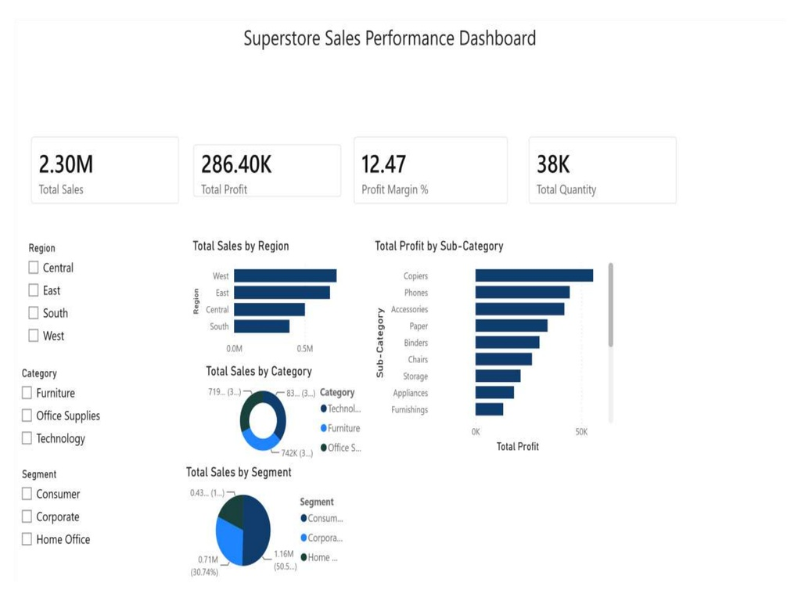

# Superstore Sales Performance Dashboard — Power BI


An interactive Power BI business intelligence dashboard analyzing **9,994 US retail transactions** across 4 regions and 17 product sub-categories — built with custom DAX measures and dynamic slicer-driven filtering.

---



---

## Key Results

## Dashboard Preview

| Metric | Value |
|--------|-------|
| Total Sales | **$2.30M** |
| Total Profit | **$286.40K** |
| Profit Margin | **12.47%** |
| Total Quantity Sold | **38K units** |
| Regions Analyzed | 4 (West, East, Central, South) |
| Product Sub-Categories | 17 |
| Visual Types Built | 6 |

---

## Dashboard Features

### KPI Cards
- Total Sales, Total Profit, Profit Margin %, and Total Quantity — all dynamic, updating with every slicer selection

### Charts Built
| Visual | Insight |
|--------|---------|
| Bar chart — Total Sales by Region | West leads with ~$0.5M, South lowest |
| Donut chart — Total Sales by Category | Technology (35%), Furniture (31%), Office Supplies (32%) |
| Pie chart — Total Sales by Segment | Consumer 50.5%, Corporate 30.74%, Home Office remainder |
| Bar chart — Total Profit by Sub-Category | Copiers most profitable, Furnishings lowest |

### Slicers (Interactive Filters)
- **Region** — Central, East, South, West
- **Category** — Furniture, Office Supplies, Technology
- **Segment** — Consumer, Corporate, Home Office

All KPIs and charts update dynamically when slicers are applied.

---

## DAX Measures Used

```dax
-- Total Sales
Total Sales = SUM(Orders[Sales])

-- Total Profit
Total Profit = SUM(Orders[Profit])

-- Profit Margin %
Profit Margin % = DIVIDE([Total Profit], [Total Sales], 0) * 100

-- Total Quantity
Total Quantity = SUM(Orders[Quantity])
```

---

## Tech Stack

`Power BI Desktop` `DAX` `Excel` `KPI Card Design` `Slicer Filtering` `Data Visualization`

---

## How to Open

1. Download `Superstore_Dashboard.pbix` from this repo
2. Open **Power BI Desktop** (free — [download here](https://powerbi.microsoft.com/desktop/))
3. The data is embedded in the file — no external connection needed
4. Use the slicers on the left panel to filter by Region, Category, or Segment

---

## Dataset

- **Source:** Sample Superstore dataset (built into Power BI / Tableau)
- **Records:** 9,994 orders
- **Fields:** Order date, ship date, region, category, sub-category, sales, profit, quantity, discount
- **Time Period:** 2014–2017

---

## Project Context

Built as part of my data analytics portfolio to demonstrate:
- Business intelligence dashboard design in Power BI
- DAX measure creation for dynamic KPI calculations
- Multi-visual layout with interactive cross-filtering
- Executive-ready reporting for retail sales performance

---

## Author

**Meshwa Patel** — Data Analyst  
[Portfolio](https://meshwa-gif.github.io) · [LinkedIn](https://www.linkedin.com/in/meshwapatel-2b24a8385) · [Email](mailto:meshwapatel2508@gmail.com)
